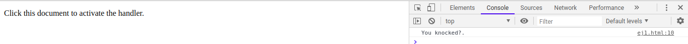
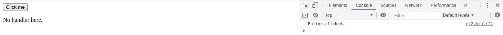
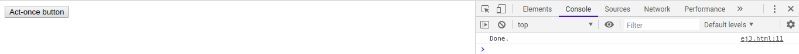

# p3-t2-handling-events-alu0100658705
# Pablo Bethencourt Díaz
# alu0100658705@ull.edu.es

## Apuntes Handling Events:

### Event Handlers

Un mecanismo para que el sistema nos avise sobre el comportamiento de nuestro código es mediante el uso de notificaciones. Veamos un ejemplo; definimos un fichero html, que contiene el siguiente código:

<pre><code><!DOCTYPE html>
<html lang="en">
    <head>
        <title> Ejemplo 1</title>
    </head>
    <body>
        
 Click this document to activate the handler.

        
    </body>
</html></code></pre>

Donde *window* hace referencia a un objeto proporcionado por el navegador, y representa la ventada que contiene el documento. El método *addEventListener* se encarga de registrar el segundo argumento, que será llamado cuando ocurra el evento definido en el primer argumento. Veamos que sucede cuando pulsamos sobre la ventana del navegador:

### Events and Dom Nodes

Cada controlador de eventos se registra en un determinado contexto, en el caso anterior se utilizaba el objeto *window*, no obstante se pueden utilizar otros objetos contenidos en el DOM y de otros tipos. Estos objetos o *Event listeners* son invocados unicamente cueando ocurre el evento en el contexto sobre el objeto está registrado. En este caso el *Event listener* será un botón, que cuando se pulsa, activa el controlador:

<pre><code> <!DOCTYPE html>
<html lang="en">
    <head>
        <title> Ejemplo 1</title>
    </head>
    <body>
        <button>Click me</button>
        
No handler here.

        
    </body>
</html> </code></pre>

El método *addEventListener* permite añadir cualquier número de controladores, por lo que es seguro añadir nuevos controladores a un elemento aunque ya existan otros asignados al mismo.

Por otra parte tenemos el método *removeEventListener* que permite eliminar un controlador de un elemento. En el código que se muestra a continuación, cuando se realice el primer "click" se eliminará el controlador, por lo que las siguientes veces no se activará. Vemos el código utilizado y us salida:

<pre><code><!DOCTYPE html>
<html lang="en">
    <head>
        <title> Ejemplo 1</title>
    </head>
    <body>
        <button>Act-once button</button>
        
    </body>
</html></code></pre>

### Event Objects

