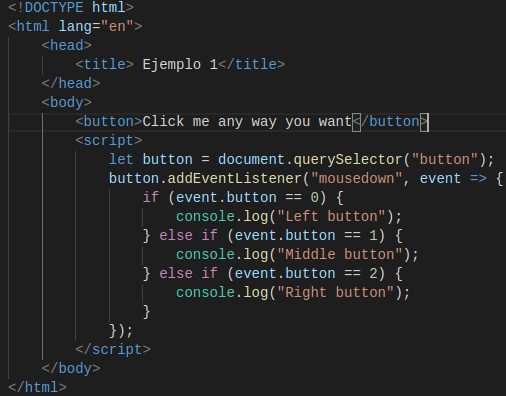
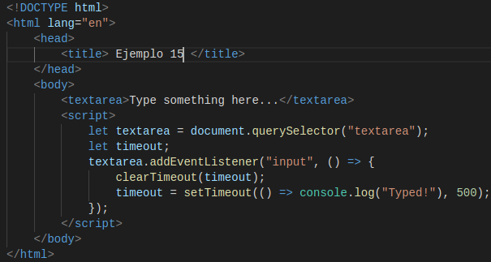

# p3-t2-handling-events-alu0100658705
# Pablo Bethencourt Díaz
# alu0100658705@ull.edu.es

## Apuntes Handling Events:

### Event Handlers

Un mecanismo para que el sistema nos avise sobre el comportamiento de nuestro código es mediante el uso de notificaciones. Veamos un ejemplo; definimos un fichero html, que contiene el siguiente código:

Donde *window* hace referencia a un objeto proporcionado por el navegador, y representa la ventada que contiene el documento. El método *addEventListener* se encarga de registrar el segundo argumento, que será llamado cuando ocurra el evento definido en el primer argumento. Veamos que sucede cuando pulsamos sobre la ventana del navegador:

### Events and Dom Nodes

Cada controlador de eventos se registra en un determinado contexto, en el caso anterior se utilizaba el objeto *window*, no obstante se pueden utilizar otros objetos contenidos en el DOM y de otros tipos. Estos objetos o *Event listeners* son invocados unicamente cueando ocurre el evento en el contexto sobre el objeto está registrado. En este caso el *Event listener* será un botón, que cuando se pulsa, activa el controlador:

El método *addEventListener* permite añadir cualquier número de controladores, por lo que es seguro añadir nuevos controladores a un elemento aunque ya existan otros asignados al mismo.

Por otra parte tenemos el método *removeEventListener* que permite eliminar un controlador de un elemento. En el código que se muestra a continuación, cuando se realice el primer "click" se eliminará el controlador, por lo que las siguientes veces no se activará. Vemos el código utilizado y us salida:

### Event Objects

El *Event Object* es pasado a la función controladora de evento como argumento, contiene información adicional sobre el evento, y además puede tener una serie de propiedades. Por ejemplo el objeto *button* nos puede informar con que elemento del ratón ha sido presionado:

### Propagation

Para la mayoría de eventos, los controladores registros en nodos con hijos, recibirán los eventos que sucedan en los hijos:

Los eventos se propagan hacia afuera: en este caso primero va el controlador del botón, y luego se expande hasta el párrafo.

El método *stopPropagation* evita que los controladores que están arriba en la jerarquía reciban el evento.

Otra propiedad de los eventos es el *target* que liga el evento al nodo al que fué ligado, para evitar que se propague a otros.

### Default actions

Muchos eventos tienen de base una acción predeterminada asociada a ellos, por ello normalmente se llama a los controladores de eventos de JavaScript antes de que tenga lugar el comportamiento predeterminado. Para ello se utiliza el método *preventDefault*, vemos un ejemplo:

En este caso se define un enlace que no puede ser accedido.

### Key events

Cuando se presiona una tecla en el teclado, el navegador dispara un evento *keydown*, y cuando se deja de presionar se produce un *keyup*. 

Como se puede apreciar, cuando se presiona la tecla "v" el fondo cambia de color, y cuando se deja de presionar vuelve a su color original.

### Pointer events

Actualmente hay dos formas de seleccionar cosas en una pantalla: los ratones y las pantallas táctiles. Estos producen diferentes tipos de eventos.

**Mouse clicks**

Presionar un botón del ratón causa numerosos tipos de eventos:
1. En primer lugar tenemos los eventos *mouseup* y *mousedown* que tienen un funcionamiento similar a los eventos *keydown* y *keyup* del ratón, que ya han sido mencionados anteriormente.
2. El evento *click* se activa después del *mouseup*, y lo hace en un nodo que contiene tanto la presión como la liberación del botón.
3. El evento *dblclick* tiene lugar despúes de que dos "clics" se sucedan de forma simultanea.

Si se quiere obtener información precisa sobre el lugar donde ocurrió un evento del mouse, se puede hacer uso de las propiedades *clientX* y *clientY*, que contienen las coordenadas del evento en pixeles.

El siguiente ejemplo implementa un programa que, cada vez que se hace clic en el documento, agrega un punto debajo del puntero.

**Mouse motion**

Cada vez que el puntero del ratón se mueve, un evento *mousemove* se activa. Este evento puede ser usado para rastrear la posición del mouse. 

En el siguiente ejemplo se configura una barra, que si la arrastramos a la derecha o izquierda se hará más larga o estrecha respectivamente, para ello se configuran los controladores de eventos:

El controlador *mousemove* está registrado en toda la ventada, esto quiere decir que, incluso si el puntero sale de la barra, mientras se mantenga presionado el botón, se podrá seguir modficando el tamaño. 

Cuando dejamos de pulsar el botón, la barra dejará de cambiar de tamaño, para ello se usa la propiedad del controlador del ratón *buttons*, que cuando es igual a cero nos indica que no hay botones presionados. Cuando se mantienen presionados los botones, su valor es la suma de los códigos para esos botones: el botón izquierdo tiene el código 1, el botón derecho 2 y el medio 4. 

**Touch events**

Existen eventos específicos de interacción tactil:
1. *touchstart* se inicia cuando el dedo empieza a tocar la pantalla.
2. Cuando se mueve miestras se toca la pantalla, se produce un evento *touchmove*.
3. Cuando se deja de hacer contacto, se produce un *touchend*.

Los objetos que manejan este tipo de eventos tienen una propiedad asociada (*touches*), que contiene un objeto de puntos de tipo matriz que cada uno de los cuales tiene asociadas sus propias propiedades *clientX*. *clientY*, *pageX* y *pageY*.

### Scroll Events

Cada vez que se desplaza un elemento se activa un evento *scroll*. Entre sus principales usos está saber que está el usuario mirando actualemente, para asi, por ejemplo, deshabilitar las animaciones fuera de la pantalla.

En el ejemplo que se ve a continuación, se dibuja una barra de progreso sobre el documento y lo actualiza para llenarlo a medida que se desplaza hacia abajo:

### Focus Event

- Cuando un elemento gana el foco, el navegador dispara un evento *focus* en él.
- Cuando el elemento pierde el foco, el elemento obtiene un evento *blur*.

A diferencia del resto eventos, estos no se propagan. Se expone un ejemplo que muestraun texto de ayuda para el elemento que tiene el foco:

### Load Event

Cuando una página termina de cargar, el evento *load* se dispara en los objetos del cuerpo del documento. Normalmente esto se utiliza para programar acciones que se inicien cuando se haya cargado el documento.

Los elementos como las imágenes y las etiquetas *script* también tienen un evento *load* que indican que se cargaron los archivos a los que hacen referencia.

Los eventos *load* no se propagan.

Cuando una página se cierra se activa un evento *beforeunload* que puede servir para evitar que un usuario pierda el trabajo realizado al cerrar un documento.

### Events and the event loop

### Timers

A veces será necesario cancelar una función que se ha programado. Esto se hace almacenando el valor devuelto por *setTimeout* y llamando a *clearTimeout* en él. En este ejemplo si el método *Math.random()* devuleve un valor menor a 0.5, se llamará a la función *clearTimeout*:

Un conjunto similar de funciones, *setInterval* y *clearInterval*, se utilizan para establecer temporalizadores que se repiten cada X segundos:

### Debouncing

Existen algunos eventos que tienen el potencial de dispararse rápidamente y muchas veces de forma consecutiva, por lo tanto se puede dar el caso que estos eventos requieran mucho tiempo y el controlador se demore atendiendolos y cause que la interacción con el documento empiece a realentizarse. 

En el siguiente ejemplo, se espera a que ocurra una pausa mientras el usuario escribe para que se active el controlador de eventos:

Si se quiere espaciar las respuestas para que estén separadas por al menos un cierto período de tiempo, por ejemplo, se podría querer responder a eventos *mousemove* mostrando las coordenadas actuales pero solo cada 250 milisegundos:

## Ejercicios