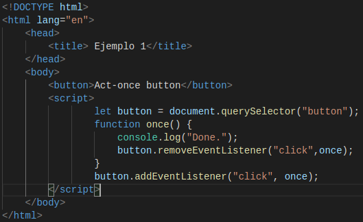

# p3-t2-handling-events-alu0100658705
# Pablo Bethencourt Díaz
# alu0100658705@ull.edu.es

## Apuntes Handling Events:

### Event Handlers

Un mecanismo para que el sistema nos avise sobre el comportamiento de nuestro código es mediante el uso de notificaciones. Veamos un ejemplo; definimos un fichero html, que contiene el siguiente código:

Donde *window* hace referencia a un objeto proporcionado por el navegador, y representa la ventada que contiene el documento. El método *addEventListener* se encarga de registrar el segundo argumento, que será llamado cuando ocurra el evento definido en el primer argumento. Veamos que sucede cuando pulsamos sobre la ventana del navegador:

### Events and Dom Nodes

Cada controlador de eventos se registra en un determinado contexto, en el caso anterior se utilizaba el objeto *window*, no obstante se pueden utilizar otros objetos contenidos en el DOM y de otros tipos. Estos objetos o *Event listeners* son invocados unicamente cueando ocurre el evento en el contexto sobre el objeto está registrado. En este caso el *Event listener* será un botón, que cuando se pulsa, activa el controlador:

El método *addEventListener* permite añadir cualquier número de controladores, por lo que es seguro añadir nuevos controladores a un elemento aunque ya existan otros asignados al mismo.

Por otra parte tenemos el método *removeEventListener* que permite eliminar un controlador de un elemento. En el código que se muestra a continuación, cuando se realice el primer "click" se eliminará el controlador, por lo que las siguientes veces no se activará. Vemos el código utilizado y us salida:

### Event Objects

El *Event Object* es pasado a la función controladora de evento como argumento, contiene información adicional sobre el evento, y además puede tener una serie de propiedades. Por ejemplo el objeto *button* nos puede informar con que elemento del ratón ha sido presionado:

### Propagation

Para la mayoría de eventos, los controladores registros en nodos con hijos, recibirán los eventos que sucedan en los hijos:

Los eventos se propagan hacia afuera: en este caso primero va el controlador del botón, y luego se expande hasta el párrafo.

El método *stopPropagation* evita que los controladores que están arriba en la jerarquía reciban el evento.

Otra propiedad de los eventos es el *target* que liga el evento al nodo al que fué ligado, para evitar que se propague a otros.

### Default actions

Muchos eventos tienen de base una acción predeterminada asociada a ellos, por ello normalmente se llama a los controladores de eventos de JavaScript antes de que tenga lugar el comportamiento predeterminado. Para ello se utiliza el método *preventDefault*, vemos un ejemplo:

En este caso se define un enlace que no puede ser accedido.

### Key events

Cuando se presiona una tecla en el teclado, el navegador dispara un evento *keydown*, y cuando se deja de presionar se produce un *keyup*. 

Como se puede apreciar, cuando se presiona la tecla "v" el fondo cambia de color, y cuando se deja de presionar vuelve a su color original.

### Pointer events

Actualmente hay dos formas de seleccionar cosas en una pantalla: los ratones y las pantallas táctiles. Estos producen diferentes tipos de eventos.

**Mouse clicks**

Presionar un botón del ratón cause numerosos tipos de eventos:
1. En primer lugar tenemos los eventos *mouseup* y *mousedown* que tienen un funcionamiento similar a los eventos *keydown* y *keyup* del ratón, que ya han sido mencionados anteriormente.
2. El evento *click* se activa después del *mouseup*, y lo hace en un nodo que contiene tanto la presión como la liberación del botón.
3. 